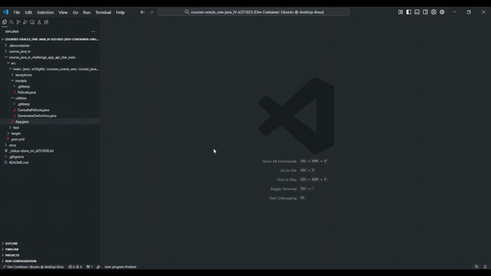

<!-- Badges:
- Source: 'https://shields.io/docs/static-badges', 'https://shields.io/badges/static-badge'.
- HTML structure followed: 'https://github.com/facebook/docusaurus/blob/main/README.md?plain=1'.
- Badges with logos: 'https://shields.io/docs/logos', 'https://simpleicons.org/', 'https://github.com/simple-icons/simple-icons/blob/master/slugs.md'.
- HTML <a> tag not redirecting: 'https://stackoverflow.com/questions/8260546/make-a-html-link-that-does-nothing-literally-nothing/8260561#8260561', 'https://www.geeksforgeeks.org/html/how-to-create-html-link-that-does-not-follow-the-link/'.
-->

<!-- Badge: WIP

  

 -->
<!--
🚧 WIP: section under construction. 🚧
-->

<!-- Badge: Done -->

  

<!-- README structure followed:
- 'https://www.aluracursos.com/blog/como-escribir-un-readme-increible-en-tu-github/'.
- 'https://github.com/camilafernanda/GlicoCare/'.
- 'https://github.com/nasa/openmct/'.
- 'https://github.com/facebook/docusaurus'.
-->

# Basics of Java (IV).

<!--
Enable autoplay of animated images:
- 'https://stackoverflow.com/questions/72508378/enable-gif-autoplay-on-github-readme/72509078#72509078'.
- 'https://github.com/orgs/community/discussions/47709'.
- 'https://github.com/settings/accessibility'.
Image width for GitHub READMEs:
- 'https://github.com/orgs/community/discussions/42424'.
- 'https://gist.github.com/uupaa/f77d2bcf4dc7a294d109'.
-->
<!-- 

    
     
    <figcaption><small>Fig.</small></figcaption>
     

  -->

    
     
    <figcaption><small>Fig. Code execution in VS Code, of Java app in folder 'course_java_iv_challenge_app_api_star_wars'.</small></figcaption>
     

Final delivery of the 4th course: '[Java: consumir API, escribir archivos y manejar errores](https://app.aluracursos.com/course/java-consumir-api-escribir-archivos-manejar-errores)', from module (a.k.a. 'formación' in spanish) '[Java Orientado a Objetos G9 - ONE](https://app.aluracursos.com/formacion-java-grupo9-one)', of [Alura LATAM](https://www.aluracursos.com/). <b>Part of [ORACLE Next Education (ONE)](https://www.oracle.com/co/education/oracle-next-education/) education program, in LATAM</b>.

This final delivery consists of 2 projects, each one in it's own folder (using folders structure of [Maven's java build automation tool](https://github.com/a1t0ghb/courses-oracle_one-java_I-d251011/blob/main/README.md#choosing-a-java-automation-tool-for-builds-maven-vs-gradle-vs-intellijs-buitl-in-tool)):

- Course exercise; in folder: [`course_java_iv`](./course_java_iv).
- Course challenge of a shopping app; in folder: [`course_java_iv_challenge_app_api_star_wars`](./course_java_iv_challenge_app_api_star_wars).

<!-- Callouts:
- Improved format taken from examples in 'https://github.com/nasa/openmct/blob/master/README.md?plain=1'.
-->
> [!NOTE]
> This README is **mainly** written in english (en), but it might have some sections in spanish (sp), since course content is in spanish.

# ℹ About.

The course covered topics such as:

- Use of open APIs, such as:
    - OMDb API, an Open RESTful web service to obtain movie information: '<https://www.omdbapi.com>'.
    - SWAPI, an Open API for Star Wars lore and information about it's universe: '<https://swapi.dev/>'.
- Connection with APIs (**Application Programming Interface**) and practicing how to connect to them.
    - Use of HTTP protocol.
    - Understanding responses in JSON format.
- Getting to know tools for developing and testing APIs, such as:
    - Postman: '<https://www.postman.com>'.
    - Insomnia: '<https://insomnia.rest>'.
    - Apidog: '<https://apidog.com>'.
- Understanding the HTTP (**HyperText Transfer Protocol**) protocol:
    - Communication model of client-server.
    - Common methods: GET, POST, PUT, DELETE.
    - Statuses: 1xx (informative), 2xx (success), 3xx (redirects), 4xx (client's errors), 5xx (server's errors).
- Getting to know design patterns; a concept from 90's:
    - **Creation pattern**: e.g. 'Factory Method', 'Builder', and 'Singleton'.
    - **Structure pattern**: e.g. 'Adapter', 'Facade', and 'Composite'.
    - **Behavioural pattern**: e.g. 'Observer', 'Command', and 'Strategy'.
- Using Java packages / libraries to manage API connections: HTTP requests, and JSONs responses.
    - HTTP requests: `java.net` library (`HttpClient`, `HttpRequest`, `URI`, `HttpResponse`).
        - Documentation for reference: '<https://docs.oracle.com/en/java/javase/17/docs/api/java.net.http/java/net/http/package-summary.html>'.
    - JSON conversion (serialization and de-serialization) from and to Java objects: `com.google.gson` library (`Gson`, `GsonBuilder`).
        - Documentation for reference: '<https://github.com/google/gson>', '<https://www.javadoc.io/doc/com.google.code.gson/gson/latest/com.google.gson/module-summary.html>'.
- Use of Java `Record`s, as an 'intermediate' class to facilitate managing mapping of JSON fields from responses to project's classes and attributes: '<https://docs.oracle.com/en/java/javase/16/language/records.html>'.
- Use of `Exceptions` to handle possible errors in code execution.
    - Use of `try-catch` blocks vs. `throws` keyword in class definition: '<https://medium.com/@AlexanderObregon/java-exception-handling-throws-vs-try-catch-94b0abe1080d>'.
    - Understanding exceptions hierarchy: `Throwable` < `Error` | (`Exception` < `RuntimeException`). **This implies to start `catch`es with more specific exceptions, until you get to the more 'general' (or superclass)**; e.g. `RuntimeException` BEFORE `Exception`.
    - Using 'multi-catch' to group catch of several types of exceptions.
    - Creating own `Exception` for exercise purposes.
- Exporting local files in several formats, such as `.txt` and `.json`, using package / library `java.io` (`FileWriter`): '<https://docs.oracle.com/en/java/javase/17/docs/api/java.base/java/io/FileWriter.html>'.

## 🥇 Course Certificate of Completion.

Available at '<https://app.aluracursos.com/certificate/4f043ea5-83f6-4f85-982d-111c1778ddca>'.

- Estimated workload: 8h.
- Activities: 51.
- Topics:
    1. 'Requests y responses'.
    2. 'Utilizando una biblioteca externa'.
    3. 'Lidiando con excepciones'.
    4. 'Persistiendo datos en archivos'.
    5. 'Consolidando conocimientos'.

## 🔗 Links to program resources.

**PROGRAM STRUCTURE.**

- <b>*[Course]* 'Java: consumir API, escribir archivos y manejar errores'</b>: '<https://app.aluracursos.com/course/java-consumir-api-escribir-archivos-manejar-errores>'.
- *[Module]* 'Java Orientado a Objetos G9 - ONE': '<https://app.aluracursos.com/formacion-java-grupo9-one/>'.
- **ORACLE Next Education (ONE) education program, in LATAM**: '<https://www.oracle.com/co/education/oracle-next-education/>'.
- Alura LATAM education platform: '<https://www.aluracursos.com/>'.

**COURSE RESOURCES.**

- GitHub's project repository: '<https://github.com/alura-es-cursos/2047-screenmatch4>'.
    - Branch for course exercises: `Aula1` to `Aula4`. Ref.: '<https://github.com/alura-es-cursos/2047-screenmatch4/tree/Aula1>'.
    - Repo for course challenge. Ref.: '<https://github.com/alura-es-cursos/2047-starwarsapi/tree/master>'.

# 🐾 Notes About Project.

> [!NOTE]
> This section is only for reference, for documentation purposes in case of re-visiting course notes.

No aditional notes.

<!-- Embed dynamic content (image) of contributors:
- 'https://dev.to/lacolaco/introducing-contributors-img-keep-contributors-in-readme-md-gci'.
- 'https://contrib.rocks/'.
-->
# 🤝 Contributors.

Made with [contrib.rocks](https://contrib.rocks).

<!-- Authors table structure
- From repo: 'https://github.com/camilafernanda/GlicoCare/blob/main/README.md?plain=1'.
-->
# 📜 Authors.

| [ a1t0ghb](https://github.com/a1t0ghb) |
| :---: |
<!-- EOF. -->